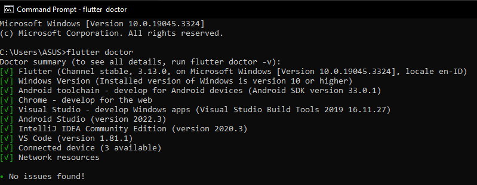
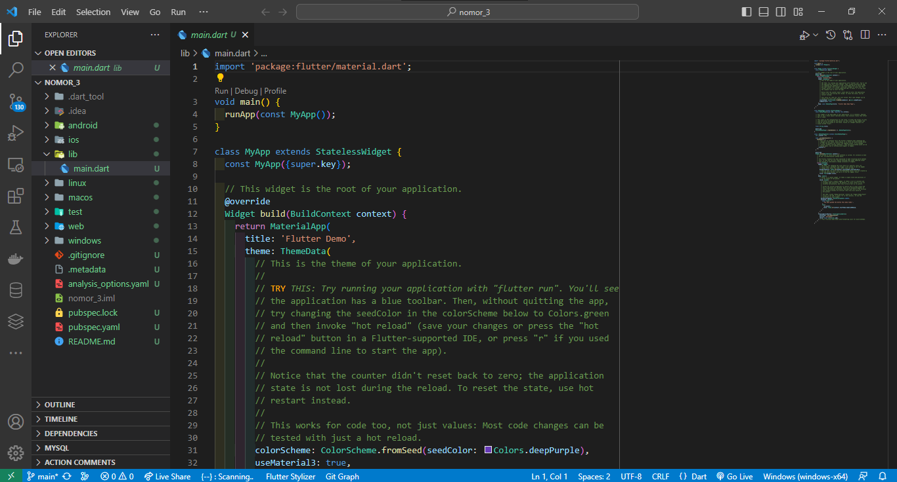

1. Sebutkan 3 aplikasi yang dibangun menggunakan teknologi Flutter! lalu screenshot
   - Aplikasi Studio Abbey Road
     

   - Aplikasi eBay
     

   - Aplikasi Nubank
     

2. Tampilkan informasi software yang dibutuhkan oleh Flutter dengan menggunakan perintah Flutter doctor! lalu screenshot
   

3. Buatlah sebuah project flutter (jika flutter berhasil dibuat tapi masih belum bisa tampil, maka masuk ke nilai prioritas 1) 
   