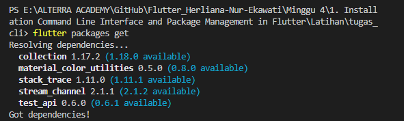
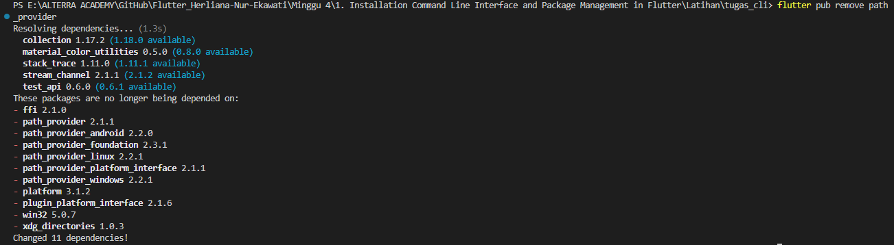
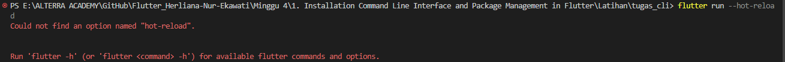
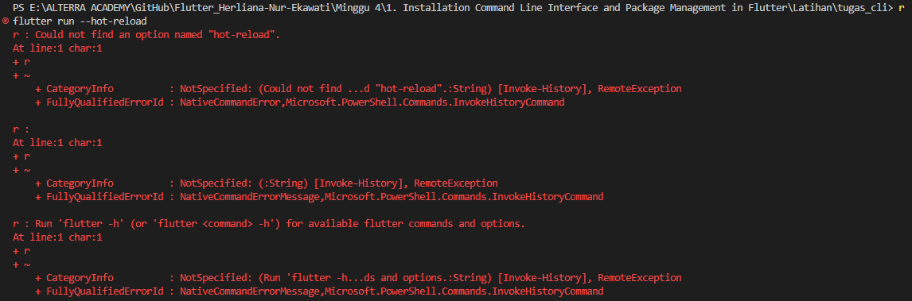
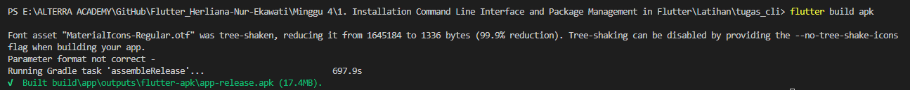
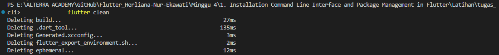

dari project yang telah kamu buat pada tugas sebelumnya, lakukan hal-hal berikut

1. Instal paket pada proyek Flutter menggunakan Flutter CLI:
   Instruksi: flutter packages get
   Contoh: flutter packages get
   

2. Hapus paket pada proyek Flutter menggunakan Flutter CLI:
   Instruksi: flutter pub remove nama_paket
   Contoh: flutter pub remove path_provider
   

3. Aktifkan Hot Reload pada proyek Flutter menggunakan Flutter CLI:
   Instruksi: flutter run --hot-reload
   Contoh: flutter run --hot-reload
   
   
   Terjadi eror saat memasukkan ke terminal. Tetapi bisa di Hot Reload menggunakan tanda kuning berikut
   

4. Buat APK atau IPA untuk proyek Flutter menggunakan Flutter CLI:
   Instruksi: flutter build apk (untuk Android) atau flutter build ios (untuk iOS)
   Contoh: flutter build apk
   

5. Bersihkan cache pada proyek Flutter menggunakan Flutter CLI:
   Instruksi: flutter clean
   Contoh: flutter clean
   