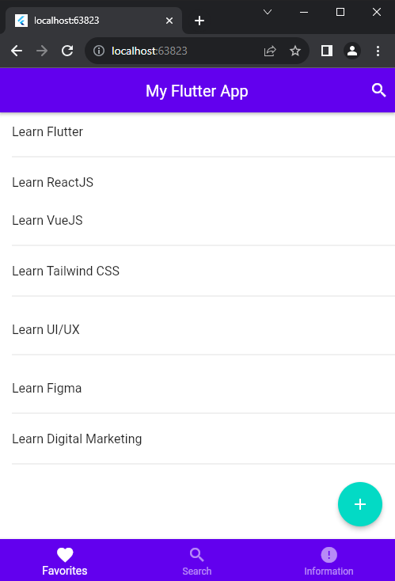

Masih pada aplikasi yang sama dengan tugas Material Design. Buatlah tampilan baru berdasarkan prototype berikut:

Kriteria:
- Tombol tidak harus berfungsi.
- Usahakan tampilan sama persis dengan prototype yang diberikan.
- Warna primary: 6200EE
- Warna secondary (untuk floating action button): 03DAC5
- navigation belum harus berfungis, untuk berpindah halaman dapat melakukannya dengan hardcode(mengganti tampilan dengan mengganti langsung code-nya).

