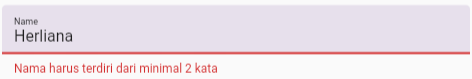

## Soal Prioritas 1
1. Buatlah sebuah halaman baru:
   
   a. Memiliki appbar dengan judul “Contacts”

   b. Memilki icon (gambar bebas)

   c. Memiliki deskripsi (text bebas)
   
   d. Buatlah sebuah Title yang bertuliskan “Create New Contacts”
   
   e. Menampilkan sebuah form input nama dan no telp

   f. Menampilkan tombol submit

   

   g. Ketika tombol di submit tekan maka akan keluar data pada console kalian seperti gambar di bawah. 

   

## Soal Prioritas 2
2. Buatlah sebuah widget baru yang terletak dibawah form “create new contacts” dengan spesifikasi berikut:
   
   a. Memiliki title “List Contacts”

   b. Menampilkan data nama dan no telp dalam listview

   c. Jika tombol submit ditekan maka data pada “List Contacts” akan bertambah

   

3. Buatlah sebuah fitur untuk menghapus data yang ada pada listview!

   

4. Buatlah sebuah fitur untuk melakukan update pada data kontak.
   
   

## Soal Eskplorasi

Lakukan validasi pada masing-masing form dengan spesifikasi seperti berikut
1. Validasi Nama
   - Nama harus diisi oleh user.
     
     

   - Nama harus terdiri dari minimal 2 kata.
     
     

   - Setiap kata harus dimulai dengan huruf kapital.

     
     
   - Nama tidak boleh mengandung angka atau karakter khusus.

     

2. Validasi Nomor Telepon
   - Nomor telepon harus diisi oleh user.

     

   - Nomor telepon harus terdiri dari angka saja.

     

   - Panjang nomor telepon harus minimal 8 digit dan maksimal 15 digit.

     

   - Nomor telepon harus dimulai dengan angka 0.

     
