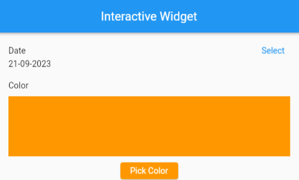
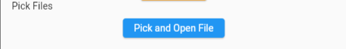
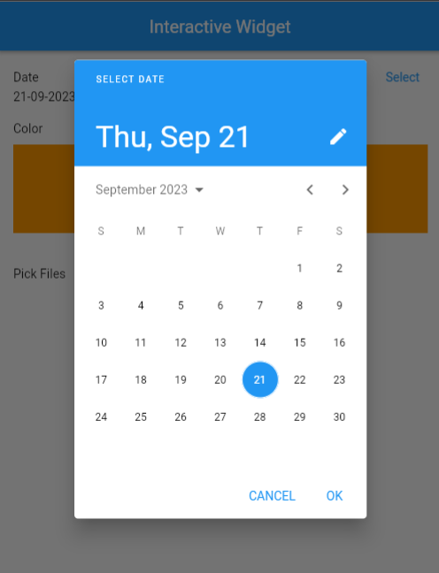
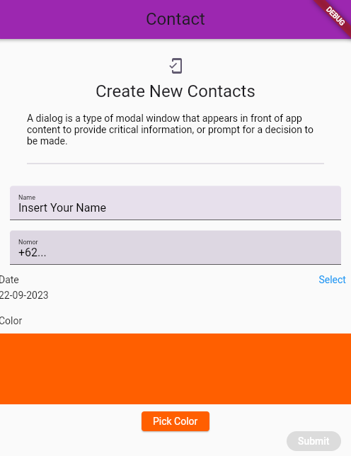

#Task Advance Form

## Soal Prioritas 1

1. Buat sebuah halaman baru dan implementasikan datepicker dan color picker seperti pada gambar dan video contoh pembuatan ada di LMS
   
   

2. Implementasikan file picker seperti yang dicontohkan pada video
   
   

   - Standar minimal untuk mendapatkan nilai prioritas 1 adalah ketika form dapat berfungsi sama seperti pada video  atau  gif  berikut 
    
   

## Soal Prioritas 2

1. Tambahkan date, color, dan file picker pada bagian berikut 
   

2. Ketika button submit ditekan akan memasukkan data name, nomor, date, color dan name  file ke dalam variabel yang telah kalian buat. 

3. Untuk membuktikan bahwa data telah berhasil untuk masuk, kalian cukup melakukan logDev pada console. 
   - Tampilan untuk soal berikut tidak ditentukan, kalian bebas bereksperimen terkait user interface yang kalian buat
   - Yang terpenting adalah fungsionalitas
   - Jika button submit di klik maka akan keluar data berdasarkan value pada nama dan nomor, date, color dan name file

## Soal Ekplorasi

1. Tampilan data pada variabel yang kalian punya ke dalam user interface list contacts

2. Pastikan setiap data dapat tampil pada list contact, kerapian dan user interface yang menarik akan menjadi perhitungan mentor
   - Kalian bebas bereksperimen terkait user interface pada list contacts
   - Gambaran hasil akhir akan seperti gambar berikut
