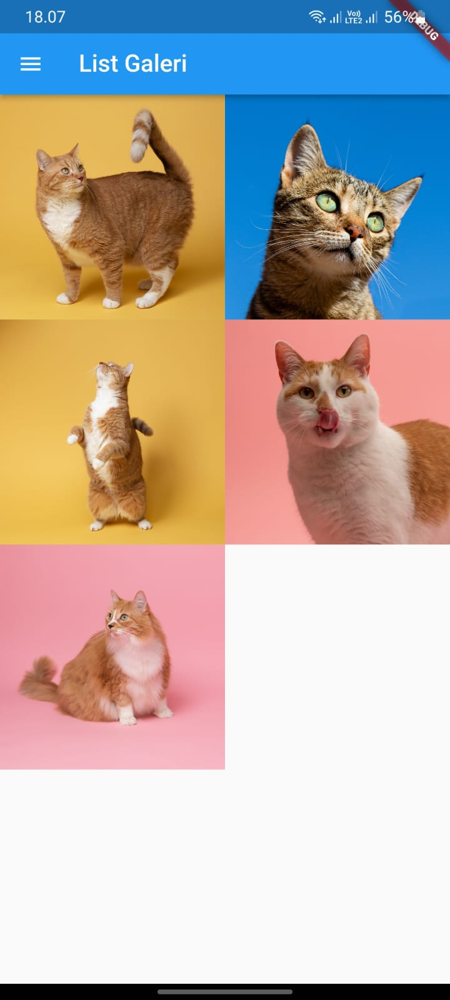
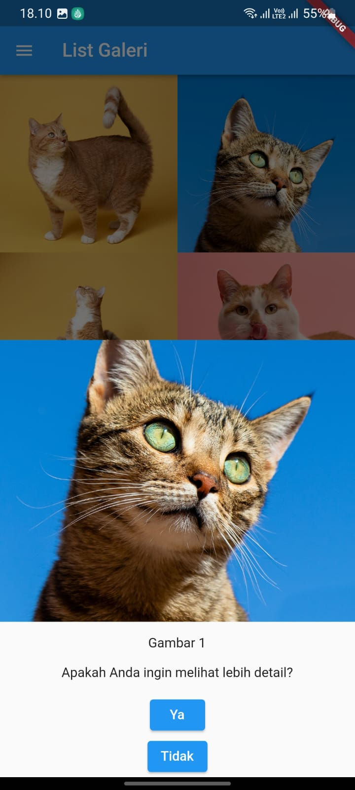
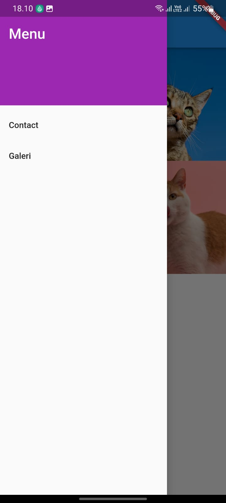
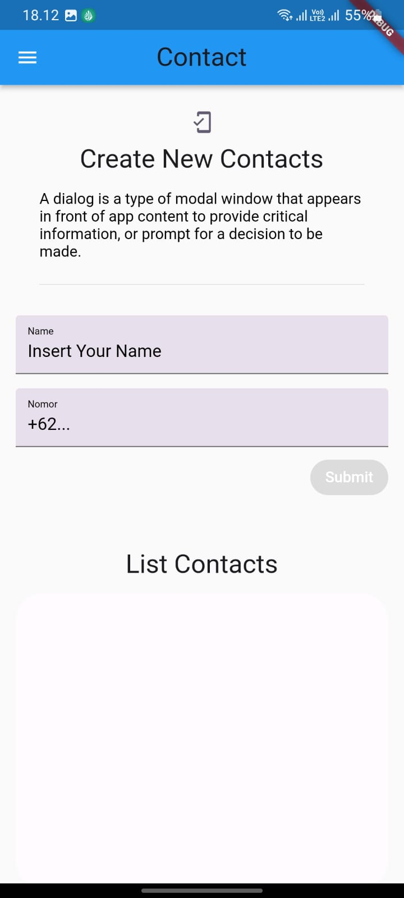

#Assets, Dialog & Bottomsheet, Navigation

## Soal Prioritas 1
Manfaatkan project yang telah kalian buat pada tugas sebelumnya dan lakukan hal-hal berikut.

1. Buat halaman baru dan buat sebuah galeri yang menampilkan gambar gambar dalam bentuk grid!
2. Gunakan Gridview saat pembuatan soal no 1!
3. Buatlah agar setiap gambar dapat ditampilkan pada bottomsheet saat ditekan
4. Pada bottomsheet , berikan 2 pilihan ya & tidak. Jika memilih ya maka akan masuk ke halaman baru dan jika memilih tidak akan menutup dialog

   

   

## Soal Prioritas 2
1. Pasang drawer pada aplikasi kalian dan berfungsi button untuk berpindah halaman.
2. Terdapat 2 button pada drawer tersebut yaitu Contact dan Galeri.

   

3. Jika Contact di tekan maka akan mengarah ke halaman contact.

   
  
4. Jika Galeri di tekan akan mengarah ke halaman List Galeri.

   

5. Modifikasi navigasi aplikasi yang telah dibuat dengan menggunakan routes.
6. Hubungkan setiap halaman yang telah kalian buat sampai sekarang dengan navigation di flutter.

## Soal Eksplorasi
1. Pada halaman baru, tampilkan gambar berdasarkan gambar yang dipilih / ditekan.
